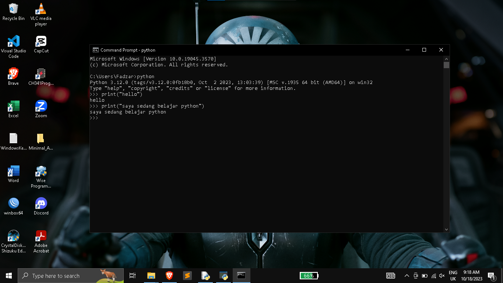
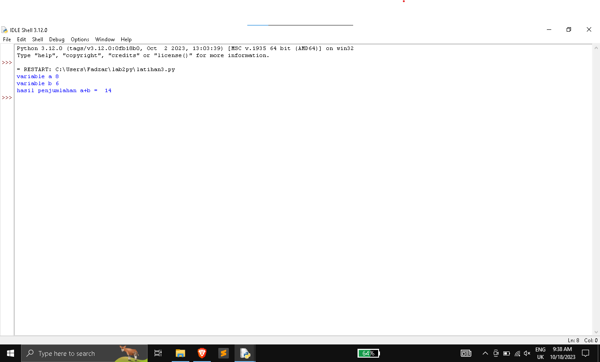
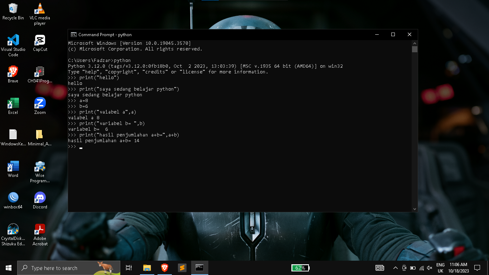

# <strong>Praktikum python</strong>
> <strong>Sebagai tugas praktikum ke-2 | Universitas Pelita Bangsa</strong>

## <b>Laporan Praktikum</b>
## Latihan 1
* Menjalankan Python Console
* Menampilkan tulisan “Hello” dilayar
* Menampilkan tulisan "Sedang Belajar Python" dilayar
```
Print("Hello")
Print("Sedang Belajar Python")
```
> Python Bersifat Case Sensitive, jadi perhatikan besar-kecil huruf yang digunakan
### Maka outputnya :


## Latihan 2
* Menjumlahkan dua buah bilangan menggunakan variabel a dan b.
* Mendefinisikan variable a dengan nilai 8
* Mendefinisikan variable b dengan nilai 6
* Mencetak nilai variable a dan b
* Mencetak hasil penjumlahan a+b
```
a = 8
b = 6
print("Variable a=",a )
print("Variable b=",b )
print("Hasil penjumlahan a+b=",a + b )
```
> <b>a  +  b</b> bisa saja ditulis menjadi <b>a+b</b> tapi penggunaan Python mempunyai standar keteraturan.

### Maka Outputnya :
> **Menggunakan IDLE**


> **Menggunakan Command Prompt**


## Latihan 3
* Menjalankan IDLE
* Membuat file baru dengan nama latihan3.py (pastikan lokasi file
pada folder lab2py pada direktori kerja anda)
* Menggunakan fungsi input untuk mengambil nilai variabel dari
keyboard.

### Maka Outputnya :


```
 # Input nilai variable
 a = input("Masukkan nilai a: ")
 b = input("Masukkan nilai b: ")

 # Cetak nilai variable
 print("Variable a =", a)
 print("Variable b =", b)

 # Cetak hasil operasi kedua variable dengan string format
 print("Hasil penggabungan {0} & {1} ={2}".format(a,b, a+b))

 # Anda harus mengonversi a dan b ke tipe data int sebelum melakukan operasi matematika
 a = int(a)
 b = int(b)
 print("Hasil penjumlahan {0} + {1} = {2}".format(a,b, a + b))

 # Konversi nilai variable sudah dilakukan di atas, jadi tidak perlu dilakukan lagi
 # Perhatikan bahwa operasi pembagian akan menghasilkan float, bukan int
 print("Hasil pembagian {0} / {1} = {2:.2f}".format(a,b, a / b))
```
* **int** berfungsi untuk mendefinisikan sifat perintah menjadi bilangan bulat.
* **input** berfungsi untuk memasukan kata atau bilangan yang diinginkan.
* **, a** dan **, b** berfungsi untuk meletakan variabel yang sudah didefinisikan sebelumnya.
* **{0}***, **{1}** dan **{2}** berfungsi untuk memanggil variabel sesuai urutan.
* **.format(a,b, a / b))** digunakan untuk mengubah bilangan integer menjadi string atau untuk menggabungkan nilai variabel dengan string
* **{2:.2f}*** digunakan untuk membatasi maksimal 2 angka setelah koma (.) pada bilangan desimal 

## <font color="orange">Documentation</font>
> <p font face="Times New Roman">All associated resources are licensed under the [MIT License](https://mit-license.org/).</p>
